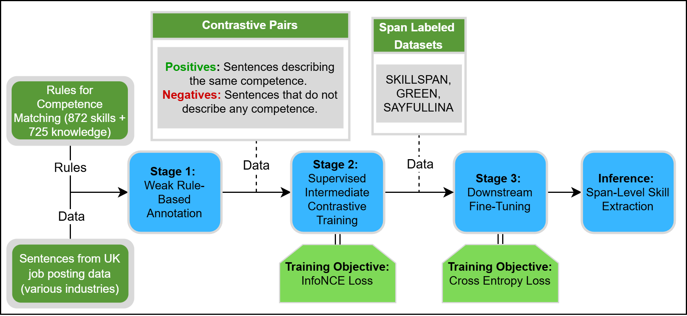

# ContrastSkill
This repository describes ContrastSkill, a supervised contrastive pre-training framework for span-level skill extraction from sentences. 

Below is a high-level overview of the proposed framework:



## ContrastSkill
All the experiments are based on torch 2.4.1 + cu121.
To install required libraries enter, use:
```bash
bash pip install -r ./requirements.txt 
```

First, clone this repository, and make sure all the data and output paths are correct. If you want to deploy ContrastSkill, you need to first download the pre-trained model from (models will be provided upon acceptance). Upload the pre-trained model to the designated folder (e.g., Model_SKILLSPAN in the deploy_final.sh example). Then navigate to the project repository in your terminal and run:
```bash
bash deploy_final.sh
```
## Supplementary Materials 
### Data Preparation and Processing
If you are interested in deploying the entire framework on your competencies dataset, see below:
1. From Data Processing folder open Extract Competencies.ipynb and follow the provided instructions. The output should be your initial sentence file with extracted competencies and relevant tokens annotated. For competence extraction, you should refer to extraction_rules.py in the Rules folder.
2. To obtain a desired format for ContrastSkill, from Data Processing open Align Matches.ipynb and follow the provided instructions. This will create a "positive" dictionary. The "negatives" are simply sentences with no matched competencies. If you require more negatives, refer to: Negative_Generation.ipynb

### Supervised Contrastive Intermediate Trained Models

To facilitate reproducibility, we released each of the Stage 2 models. Models can be accessed here: BERT (https://huggingface.co/Aleksandruz/ContrastSkill_BERT), RoBERTa (https://huggingface.co/Aleksandruz/ContrastSkill_RoBERTa), JobBERTa (https://huggingface.co/Aleksandruz/ContrastSkill_JobBERTa). To work properly, these shoudl be downloaded and uploaded into the ContrastSkill directory under 

Dummy examples for pre-training data are provided in the Data folder. 

## LLM baselines
For LLM baselines, refer to LLM-baseline.ipynb

### Synthetic Dataset Creation
If you want to use the provided rules to generate a synthetic competence dataset, refer to Example Generation.ipynb file in Data Processing folder and follow the provided instructions. The file contains the list of examples of the rules used for generation, if you whish to use the entirety of the competence matching rules, refer to rules_list.sty in the Rules folder.


 


